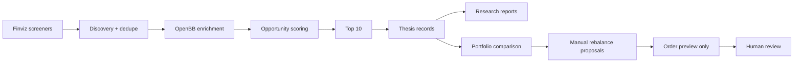
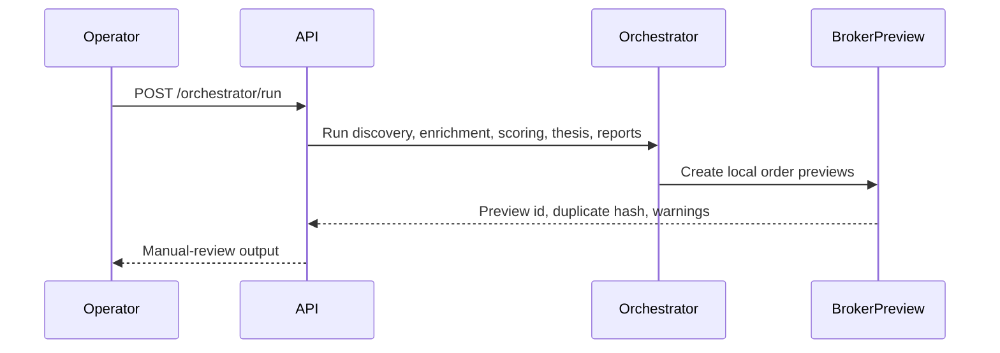

# ISA Portfolio Intelligence Architecture

This repository is one unified `isa_system` application for local-first ISA
portfolio intelligence. It keeps the existing safety-first Python/FastAPI stack
and adds Finviz discovery, OpenBB enrichment, scoring, thesis tracking,
research reports, portfolio comparison, Trading 212 read-only/order preview,
Workspace metadata, and orchestration.

Live Trading 212 order submission is not implemented.

## Data Flow

## Service Ports

| Service | Port |
| --- | ---: |
| OpenBB API | 6900 |
| OpenBB MCP | 8001 |
| ISA Portfolio Intelligence API | 8002 |

## Component Roles

- Finviz: initial candidate discovery only, with polite cached HTML fetching.
- OpenBB: local enrichment and research data layer where available.
- Trading 212: read-only broker context and local order preview only.
- SQLite: operational persistence for thesis and report records.
- Artifacts: smoke outputs, cached Finviz HTML, and Markdown reports.
- FastAPI: local API surface for workflow automation and Workspace metadata.

## Safety Boundary

The control flow ends at local order preview:

No API route submits a live Trading 212 order. `/rebalances/submit` returns
404 in this build.
