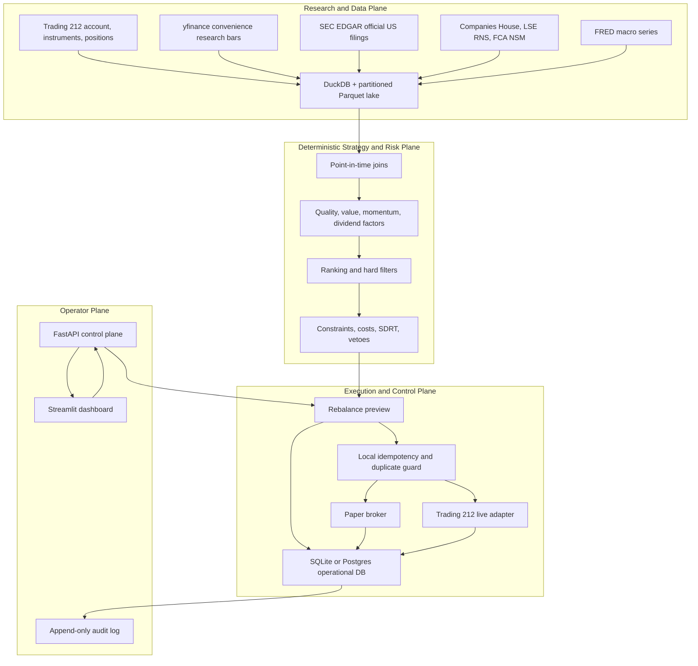
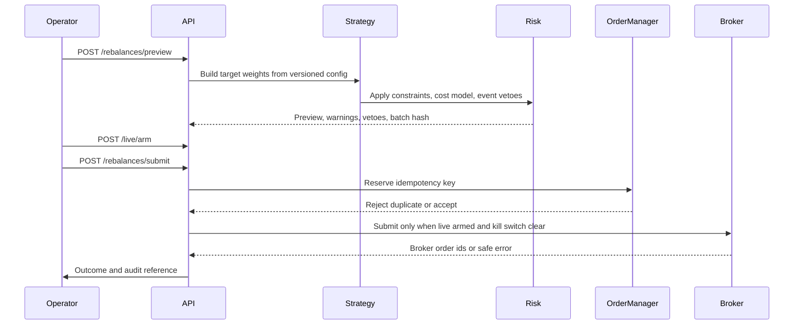

# Architecture

The starter is split into four planes and keeps all storage timestamps as
timezone-aware UTC. Europe/London conversion is only for user-facing views.

```mermaid
flowchart TD
    subgraph Data["Research and Data Plane"]
        T212["Trading 212 account, instruments, positions"]
        YF["yfinance convenience research bars"]
        SEC["SEC EDGAR official US filings"]
        UK["Companies House, LSE RNS, FCA NSM"]
        MACRO["FRED macro series"]
        LAKE["DuckDB + partitioned Parquet lake"]
    end
    subgraph Strategy["Deterministic Strategy and Risk Plane"]
        PIT["Point-in-time joins"]
        FACTORS["Quality, value, momentum, dividend factors"]
        RANK["Ranking and hard filters"]
        RISK["Constraints, costs, SDRT, vetoes"]
    end
    subgraph Control["Execution and Control Plane"]
        PREVIEW["Rebalance preview"]
        IDEM["Local idempotency and duplicate guard"]
        PAPER["Paper broker"]
        LIVE["Trading 212 live adapter"]
        DB["SQLite or Postgres operational DB"]
    end
    subgraph Operator["Operator Plane"]
        API["FastAPI control plane"]
        DASH["Streamlit dashboard"]
        AUDIT["Append-only audit log"]
    end
    T212 --> LAKE
    YF --> LAKE
    SEC --> LAKE
    UK --> LAKE
    MACRO --> LAKE
    LAKE --> PIT
    PIT --> FACTORS --> RANK --> RISK --> PREVIEW
    PREVIEW --> IDEM
    IDEM --> PAPER
    IDEM --> LIVE
    PREVIEW --> DB
    PAPER --> DB
    LIVE --> DB
    DB --> AUDIT
    API --> PREVIEW
    API --> DASH
    DASH --> API
```

## Rebalance Control Flow

```mermaid
sequenceDiagram
    participant Operator
    participant API
    participant Strategy
    participant Risk
    participant OrderManager
    participant Broker
    Operator->>API: POST /rebalances/preview
    API->>Strategy: Build target weights from versioned config
    Strategy->>Risk: Apply constraints, cost model, event vetoes
    Risk-->>API: Preview, warnings, vetoes, batch hash
    Operator->>API: POST /live/arm
    Operator->>API: POST /rebalances/submit
    API->>OrderManager: Reserve idempotency key
    OrderManager-->>API: Reject duplicate or accept
    API->>Broker: Submit only when live armed and kill switch clear
    Broker-->>API: Broker order ids or safe error
    API->>Operator: Outcome and audit reference
```
