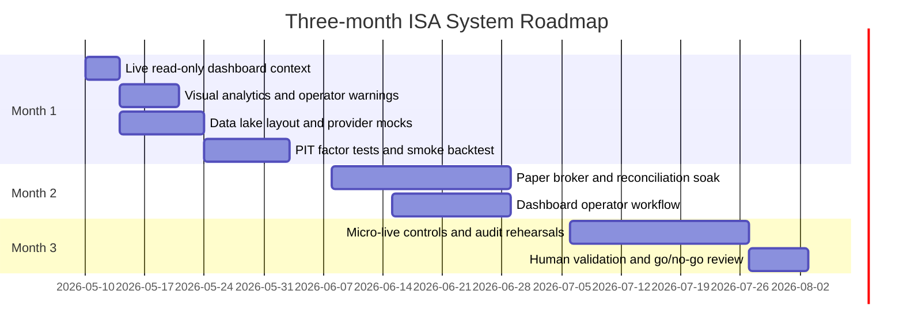

# Roadmap

## Current Progress

| Date | Status | Notes |
| --- | --- | --- |
| 2026-05-10 | Done | Initial scaffold, tests, smoke test, API, dashboard, docs, CI, and draft PR created. |
| 2026-05-10 | Done | Local dashboard connected to Trading 212 live account state through read-only endpoints only. Live order submission remains disabled. |
| 2026-05-10 | In progress | Add operator-grade visualisations, read-only portfolio analytics, clearer dashboard context, and paper-mode workflow visibility. |

## Near-Term Build Queue

| Priority | Workstream | End-user result | Safety stance |
| --- | --- | --- | --- |
| P0 | Live read-only portfolio context | Dashboard explains account value, cash, holdings, concentration, currency exposure, and warnings. | GET-only broker calls. |
| P0 | Frontend visualisations | Charts make allocations, P/L, concentration, and rebalance impact visible without reading raw tables. | Display only. |
| P1 | Paper rebalance workflow | Operator can generate a target preview, inspect costs/vetoes, and paper-fill a batch. | No live submit. |
| P1 | Data freshness and source context | Dashboard shows last refresh times, configured sources, missing data, and caveats. | Explicit warnings. |
| P2 | Catalyst/event visibility | UK/US event placeholders evolve into validated official-source context and blackout displays. | Veto-first. |
| P2 | Backtest visibility | Smoke/backtest metrics, trades, and holdings become visible in the dashboard. | Offline/synthetic first. |

| Month | Milestone | Outcome |
| --- | --- | --- |
| 1 | Stabilise local data lake, live read-only dashboard, and smoke tests | Repeatable offline research loop, PIT checks, provider mocks, visible broker context |
| 2 | Paper trading and reconciliation | Broker state snapshots, duplicate guards, paper fill comparisons, paper preview workflow |
| 3 | Controlled micro-live readiness | Human arming, runbook rehearsals, dashboard review, small live batches only after explicit approval |

