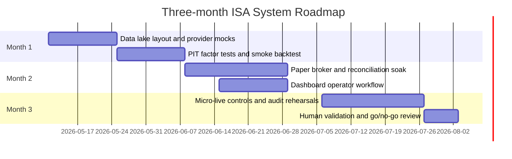

# Roadmap

| Month | Milestone | Outcome |
| --- | --- | --- |
| 1 | Stabilise local data lake and smoke tests | Repeatable offline research loop, PIT checks, provider mocks |
| 2 | Paper trading and reconciliation | Broker state snapshots, duplicate guards, paper fill comparisons |
| 3 | Controlled micro-live readiness | Human arming, runbook rehearsals, dashboard review, small live batches |

