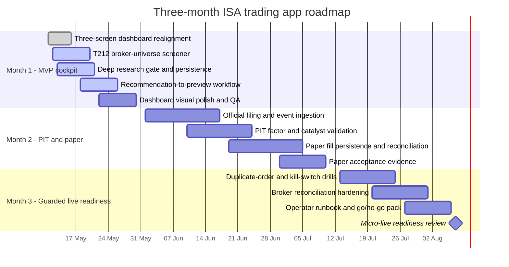

# Roadmap

This roadmap realigns the starter repository with the original brief and the
research report at `C:\Users\DanielCoakley\Downloads\deep-research-report.md`.
The product direction is a local, Codex-assisted, long-only, ISA-safe research
and preview system: daily bars, broad-market screening, point-in-time evidence,
manual review, paper/manual approval, and guarded live controls.

The MVP is not an autonomous trading bot. It is a screener and review cockpit
that can generate preview-only sizing after deterministic gates and a deep
research assessment pass.

## Status Key

| Status | Meaning |
| --- | --- |
| Done | Implemented in the starter and covered by tests or smoke checks where practical. |
| In progress | Visible in code, API, or dashboard, but still needs depth, validation, or operator polish. |
| Planned | Required by the original intent, but not yet a reliable product slice. |
| Guarded | Intentionally blocked until paper evidence, reconciliation, and explicit human controls pass. |

## MVP Action Plan

| Priority | Milestone | End-user result | Status |
| --- | --- | --- | --- |
| P0 | Simplify UI to three primary screens | Operator sees Overview, Recommendations, and Research Review instead of repeated tabs and duplicate tables. | Done |
| P0 | Use Trading 212 instrument metadata as broad scan seed | Recommendations can scan a broker-derived candidate universe, capped by config, with YAML fallback when metadata is unavailable. | In progress |
| P0 | Add consolidated recommendation queue | Holdings and screener candidates appear in one table with action, score, broker validation, blockers, research status, and preview eligibility. | Done |
| P0 | Add deep research gate | BUY/add rows require a persisted, non-expired OpenAI-backed `RESEARCH_PASSED` review before preview sizing. | In progress |
| P0 | Add recommendation-to-preview route | Selected eligible recommendations produce preview-only sizing, notional, costs, warnings, and blockers without submitting orders. | In progress |
| P1 | Add paper reconciliation loop | Paper fills are persisted, reconciled, and compared with expected preview rows. | Planned |
| P1 | Expand official point-in-time evidence | SEC, Companies House, LSE RNS, FCA NSM, and FRED evidence drives event validation and PIT factor joins. | Planned |
| P2 | Guarded micro-live readiness | Live submission remains disabled unless arming, kill switch, idempotency, reconciliation, and operator runbook checks all pass. | Guarded |

## Requirement Status

| Required functionality | Current status | Next action |
| --- | --- | --- |
| Live read-only Trading 212 portfolio | Done | Keep order endpoints guarded; improve metadata caching and diagnostics. |
| Broad-market screener | In progress | Improve T212 universe filtering, liquidity evidence, stale-data flags, and top-candidate ranking. |
| Recommendation MVP | Done, then expand | Add source freshness badges, rank changes, and official-source evidence alongside convenience metrics. |
| Deep research assessment | In progress | Add richer evidence packets, expiry policy controls, and review comparison over time. |
| Valuation and technical context | In progress | Strengthen factor definitions, peer/sector context, and valuation scenarios. |
| Sentiment and news | Planned | Keep social feeds disabled by default; prioritise official announcements, PDMR dealing, and short disclosures. |
| Catalysts and event vetoes | In progress | Tie UK RNS/NSM and SEC/Companies House event records into no-buy windows. |
| Point-in-time correctness | In progress | Expand `available_at_utc` joins and tests across fundamentals and events. |
| Rebalance preview | In progress | Accept selected research-passed candidates, estimate costs, and show sleeve/cash impact. |
| Paper trading | Planned | Persist paper orders, fills, reconciliation, and audit events. |
| Live trading | Guarded | Remain blocked until paper acceptance evidence and explicit user request. |

## Research Report Alignment

| Finding from research report | Roadmap implication |
| --- | --- |
| V1 should be daily-bar, long-only, and catalyst-aware. | Keep the MVP on EOD evidence, no leverage, no shorts, no derivatives, no intraday execution logic. |
| Trading 212 is account, execution, accessible-universe, and reconciliation source of truth. | Use `/equity/metadata/instruments` to seed the scan universe, while using convenience feeds only for research bars and enrichment. |
| Identifier mismatch is a core operational risk. | Keep broker ticker, research symbol, ISIN, and source identifiers visible in recommendation and review records. |
| Recommendations should be explainable but not autonomous. | Continue deterministic scoring plus OpenAI thesis validation, with risk checks and event vetoes remaining authoritative. |
| The algo sleeve should be configurable up to 20%. | Keep preview sizing percentage-based and avoid account-size assumptions. |
| UK frictions matter. | Show SDRT, FX, slippage, and spread assumptions in preview and backtest outputs. |
| Official disclosures should be the truth layer. | Use SEC, Companies House, LSE RNS, FCA NSM, and FRED timestamps for PIT availability and event validation. |

## Public Interface Milestones

| Endpoint | Status | Purpose |
| --- | --- | --- |
| `GET /recommendations/screener` | Done | Return broad-market screener rows, filters, warnings, and top candidates. |
| `POST /research-reviews/run` | Done | Run and persist deep research for one candidate. |
| `GET /research-reviews/latest?symbol=...` | Done | Return latest review and expiry status for a symbol. |
| `GET /recommendations/handoff` | Done | Include research status, review id, deep-research requirement, and preview eligibility. |
| `POST /rebalances/from-recommendations/preview` | Done | Return preview-only sizing/cost/risk rows for selected eligible recommendations. |

## Three-Month Milestone Table

| Month | Milestone | Included requirements | Exit criteria |
| --- | --- | --- | --- |
| Month 1 | MVP cockpit and research gate | Three-screen UI, T212 read-only context, broker-universe screener, consolidated recommendations, OpenAI deep research gate, preview-only hand-off | Operator can see account health, review candidates, run deep research, and create preview-only sizing without any order path. |
| Month 2 | Point-in-time research and paper workflow | Official-source ingestion, PIT joins, richer factors, catalyst vetoes, paper fills, reconciliation, audit replay | Paper cycles are repeatable and auditable; PIT tests reject future information. |
| Month 3 | Guarded live readiness | Idempotency drills, kill-switch drills, broker reconciliation, runbook evidence, micro-live go/no-go checklist | Live remains disabled by default and is only considered after repeated paper acceptance evidence. |

## Acceptance Notes

- BUY/add candidates must have broker metadata validation and a non-expired
  `RESEARCH_PASSED` deep research review before preview sizing.
- Sell/trim candidates remain risk-reviewed but do not require a fresh deep
  research review.
- Deep research is a thesis validator and evidence gate, not investment advice
  and not an order authority.
- Convenience feeds support screening and context only. Official sources and
  `available_at_utc` decide point-in-time availability.
- Live submission remains guarded behind explicit arming, kill switch state,
  duplicate-order prevention, reconciliation, and operator approval.
