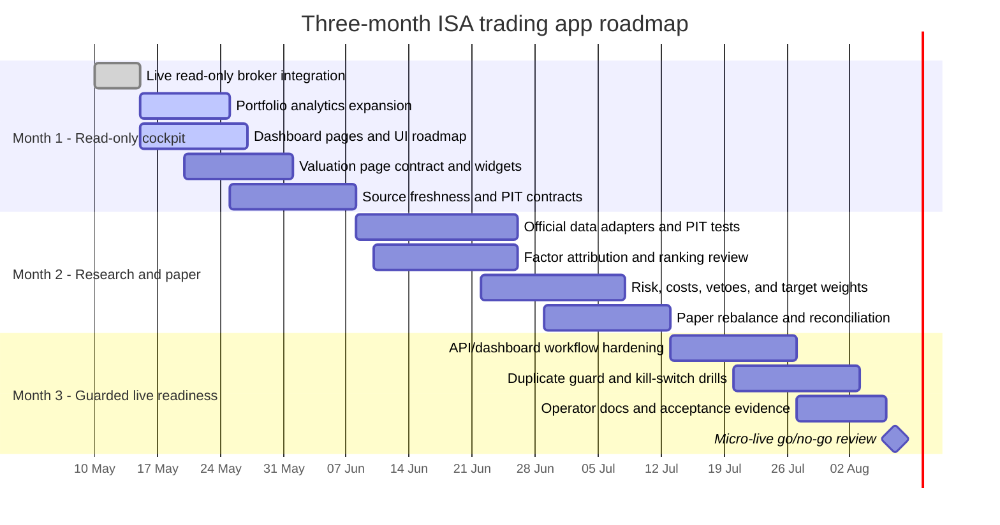

# Roadmap

This roadmap maps the original ISA trading app requirements into delivery
milestones. The system stays local-first, long-only, ISA-aware, and cautious:
live broker access is used for read-only context until paper workflows,
point-in-time data checks, risk controls, and operator reviews are mature.

## Status Key

| Status | Meaning |
| --- | --- |
| Done | Implemented in the starter and covered by existing smoke, unit, integration, or documentation checks where applicable. |
| In progress | Partly implemented, visible in the app or API, and needing richer behaviour or validation. |
| Planned | Required by the product brief, but still roadmap-level. |
| Guarded | Deliberately blocked until explicit human arming, reconciliation, and runbook checks are complete. |

## Requirement Status

| Required functionality | Current status | Evidence and next step |
| --- | --- | --- |
| Live read-only broker integration | Done | Trading 212 account summary and positions can be loaded through read-only GET calls for dashboard and analytics context. Keep order submission disabled by default. |
| Portfolio analytics | Done, then expand | Current analytics cover cash, invested value, concentration, currency exposure, top positions, and unrealised P/L where supplied. Next: valuation overlays, sleeve drift, drawdown, and benchmark context. |
| Dashboard pages | In progress | Overview, Holdings, Valuation, Catalysts, Rebalance, Factors, and Audit tabs now render live or local context. Next: paper workflow, source freshness timelines, and deeper official-source validation. |
| Point-in-time official data | Planned | Architecture names SEC EDGAR, Companies House, LSE RNS, FCA NSM, and FRED as validation or macro layers. Next: ingestion adapters, retrieved-at metadata, PIT joins, and tests that reject look-ahead data. |
| Factors and rankings | In progress | Quality, value, momentum, dividend, sector normalisation, composite scoring, and versioned strategy configs are scaffolded. Next: official timestamp alignment, missing-data policy, peer/sector valuation factors, and attribution views. |
| Risk and rebalancing | In progress | Risk checks, cost-aware preview concepts, SDRT/PTM/FX notes, idempotency, a preview-only sleeve target table, and local paper-fill simulation exist. Next: persisted paper workflow, event veto integration, rebalance audit records, and operator approval queue. |
| Paper/live controls | Guarded | Preview and paper modes are the operational default; live arming is explicit and live submit is blocked unless controls pass. Next: paper fill reconciliation, kill-switch drill evidence, duplicate-order soak tests, and micro-live readiness review. |
| API and dashboard control plane | In progress | FastAPI health, mode, rebalance, metrics, portfolio, valuation, and audit routes exist, with a Streamlit operator dashboard. Next: typed run-control, source freshness, and paper-submit endpoints consumed by dashboard pages. |
| Tests and documentation | Done, then expand | Unit, integration, smoke, docs, CI, runbook, architecture, data source, and ISA notes exist. Next: PIT provider tests, dashboard route tests, paper/live control tests, valuation tests, and operator acceptance docs. |

## Research Report Alignment

The research report at `C:\Users\DanielCoakley\Downloads\deep-research-report.md`
sets the practical direction for the next few days of buildout:

| Finding from research report | Roadmap implication |
| --- | --- |
| V1 should be daily-bar, long-only, catalyst-aware, and not intraday/HFT. | Keep new features on EOD bars, official event metadata, and operator review workflows before any live action. |
| Trading 212 is the account, execution, accessible-universe, and reconciliation source of truth, not the historical OHLC source. | Continue read-only broker integration; use convenience feeds only for research overlays and external EOD history. |
| The algorithmic sleeve should be configurable from 0% to 20% of the ISA. | Build sleeve drift, sleeve drawdown, and target-weight controls as percentages, never account-size assumptions. |
| Highest-confidence signals are quality/profitability, medium-term momentum, post-event drift, and rerating supported by official disclosures. | Prioritise quality-momentum factors, event vetoes, PDMR/short-disclosure sentiment, and explainable thesis records. |
| Identifier mismatch is a core operational risk. | Add an instrument/issuer crosswalk that links Trading 212 ticker, ISIN, FIGI where available, LEI, company number, CIK, and provider symbols. |
| UK frictions matter: SDRT, PTM levy, spreads, and Trading 212 FX fee. | Extend preview/backtest cost models so gross alpha and net alpha are shown separately. |
| FCA short-selling disclosure semantics change from 13 July 2026. | Version official-feed parsers and rules by effective date, with tests around the transition. |
| Sentiment should start with official announcements, PDMR dealing, and short disclosures rather than social feeds. | Keep Reddit/X optional and low-weight; build official-source sentiment and event tags first. |
| Immediate next vertical slice is broker auth, instrument universe, free EOD provider, FCA NSM, one quality-momentum strategy, one backtest page, one overview dashboard, and paper loop. | Use this as the delivery order for the next implementation passes. |

## Near-Term Milestones

| Priority | Milestone | Owner surface | End-user result | Status |
| --- | --- | --- | --- | --- |
| P0 | Keep live broker integration read-only | Trading 212 adapter, portfolio API, dashboard | Operator can see current account value, cash, holdings, concentration, currency exposure, and warnings without creating orders. | Done |
| P0 | Make valuation visible | Dashboard Valuation page, valuation API contract, docs | Operator can inspect current price, valuation multiples, source freshness, technical indicators, events, sentiment/news context, and missing-data warnings before any rebalance. | Done, then expand |
| P0 | Strengthen portfolio analytics | Portfolio service, dashboard widgets | Account health, sleeve drift, cash buffer, largest holdings, FX exposure, and unrealised P/L are visible at a glance. | In progress |
| P0 | Replace dashboard placeholders | Catalysts, Factors, Audit pages | Left-nav pages show live holdings context, provider events/news, starter attribution, audit status, and smoke artefacts instead of synthetic rows. | Done, then expand |
| P1 | Add PIT official data backbone | Data lake, official-source adapters, provider tests | Factors and events are joined only with data known at that time, with retrieved-at and accepted-at timestamps. | Planned |
| P1 | Complete factor attribution | Factors, configs, dashboard | Quality, value, momentum, dividend, sector-neutral adjustments, missing-data policy, and config hash are explainable per ticker. | In progress |
| P1 | Build paper rebalance workflow | Rebalancer, paper broker, audit log | Operator can generate preview-only targets, review costs and vetoes, simulate local paper fills, and later compare expected vs persisted paper fills. | In progress |
| P2 | Prepare controlled micro-live path | Runbook, duplicate guard, kill switch, broker reconciliation | Small live batches are possible only after explicit arming, passing checks, and human review. | Guarded |
| P2 | Expand test and operator evidence | Tests, docs, CI artefacts | Each promotion step has repeatable tests, smoke output, and documented acceptance criteria. | In progress |

## Three-Month Milestone Table

| Month | Milestone | Included requirements | Exit criteria |
| --- | --- | --- | --- |
| Month 1 | Read-only operator cockpit and data foundations | Live read-only broker context, portfolio analytics, dashboard pages, source freshness, valuation/technical overlays, smoke tests | Dashboard clearly shows broker state, analytics, warnings, valuation context, and missing-data caveats; live orders remain blocked; docs define PIT data contracts. |
| Month 2 | Point-in-time research and paper trading | Official data ingestion, factors, rankings, target weights, paper broker, risk checks, event vetoes | PIT tests catch look-ahead joins; factor attribution is reviewable; paper rebalances produce auditable fills and reconciliation reports. |
| Month 3 | Micro-live readiness | Live arming, kill switch, idempotency, cost controls, API/dashboard workflow, operator runbooks | Repeated paper cycles pass; duplicate-order and kill-switch drills pass; micro-live remains guarded behind human approval and documented go/no-go checks. |

## Acceptance Notes

- Live trading remains off unless the operator deliberately selects live mode,
  arms it, clears the kill switch, passes reconciliation, and accepts a reviewed
  batch hash.
- Convenience feeds can support screening and enrichment, but official sources
  and retrieved timestamps decide point-in-time availability.
- Valuation, catalyst, and starter factor output are advisory context for review,
  not automatic buy or sell signals.
- All user-facing times remain Europe/London; stored timestamps remain UTC.
